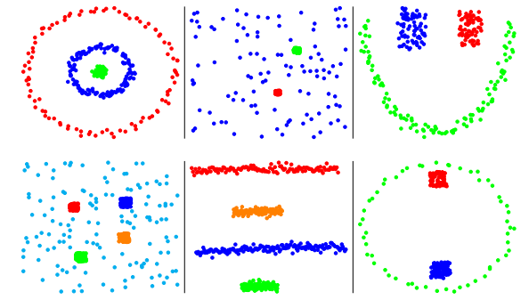

# stsc

An implementation of the Self-Tuning Spectral Clustering algorithm, and more. Based on the paper [*Self Tuning Spectral Clustering STSC*](http://www.vision.caltech.edu/lihi/Demos/SelfTuningClustering.html).

Some clusters found by the implementation on six different datasets with k in [2, 6]:

<p align="center">

</p>

## Overview
The main class to use is the self-tuning spectral clustering algorithm, `gr.armand.stsc.STSC`:

````scala
import gr.armand.stsc.STSC
// Your code to load the dataset and make it a DenseMatrix.
val (cBest, costs, clusters) = STSC.cluster(dataset)
// Two optional parameters, the minimum and maximum value of k. By default: 2 and 6.
val bestGroupNumber = STSC.cluster(dataset, 2, 10)._1
````

cBest is the most likely number of clusters in the dataset. It will always be between the minimum and maximum value of k.
costs is a map with the cost returned for each possible number of clusters k.
clusters is an Array of Int with a length equals to the number of rows in the dataset, clusters(i) represents the cluster where should be the observation i in the dataset.

If you include `gr.armand.stsc.KDTree`, you can also create a k-d tree to divide a dataset:

````scala
scala> import gr.armand.stsc.KDTree
scala> val tree = KDTree.createWithMaxObservations(dataset, maxObservationsPerTile, tileBorderWidth)
````

The third class of the library is `Tile`, a list of tiles composing a k-d tree.
A Tile is composed of two DenseVectors representing the minimums and maximums coordinates in each dimension.

The Scaladoc can be found [here](https://armand.gr/stsc).

Copyright © 2016 Armand Grillet. All rights reserved.
